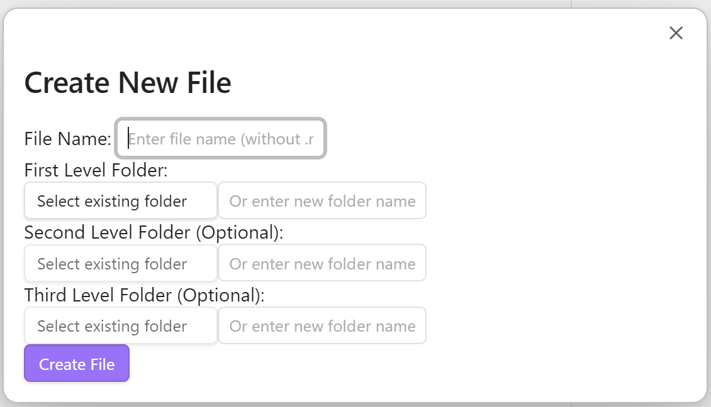

# Create-folder-notes-with-dropdown
## Description
**Create folder notes with dropdown** is an Obsidian plugin designed to help users quickly create and organize Markdown files. With this plugin, users can easily create new Markdown files based on the specified file name and folder hierarchy in an obsidian vault. If the specified folder path does not exist, the plugin will intelligently create the required folder to ensure that files can be properly classified and stored according to the user's intent.
## Interface

